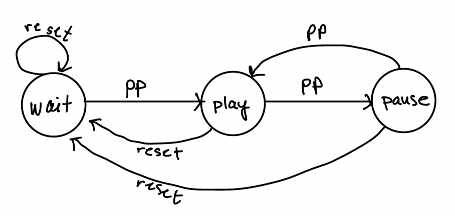

## 17: Finite State Machines

Finite State Machines (or just State Machines) are a way to model computation. They depict different _states_ that the system might be in and the _actions_ taken to get to that state. These are called the _transitions_ and are written as `f(s,a)->s`. 

As an example, consider the 2 buttons _reset_ and _play/pause_ on a game. The states that the system might be in are 1) waiting to start, 2) playing, and 3) on pause, so the states are (WAIT, PLAY, PAUSE). The actions are push a button (PP or RESET). One transition is `f(PLAY,PP)->PAUSE`. The system can be fully represented with a Finite State Machine.

Today, you will be presented with 2 problems that can be modeled with an FSM, then implemented in Python. A 3rd problem will be modeled with an FSM, but not (yet) implemented.

1. Draw the corresponding FSM for a traffic light. It has 3 states: RED, YELLOW, GREEN. The actions are the passing of time: 10 seconds expired and 3 seconds expired. The transitions are from Red to Green, Green to Yellow, and Yellow to Red. Red is on for 10 seconds, yellow on for 3 seconds, and green is on for 10 seconds. Use the game buttons example above and the provided code to implement the traffic light FSM. 

2. Draw the corresponding FSM for a flashlight whose brightness changes each time you push a button. The states are OFF, LOW, MED, and HIGH. The only action is to push the button. Implement the FSM using the provided code.

> You will notice in the code that the button is being handled in a thread that is separate from the implementation of the state machine.

3. Draw the corresponding FSM for a watch with 4 buttons. 
	- `+` button,
	- `-` button,
	- `time` button, and 
	- `date` button. 
	
	An action is a pushing of a button. 
	
	On the watch face are HH:MM for the time and MM:DD:YY for the date. The states are waiting, set hour, set minute, set month, set day, and set year. 
	
	If you want to set the time, first push the `time` button, then push the `+` and `-` buttons to increase or decrease the hour; push `time` again to set the minutes using the `+` and `-` buttons. Set `time` again to return to the waiting state. You do not have to draw transitions corresponding to actions that are ignored. For example, if the `date` button is pressed in the middle of setting the time, it can be ignored.

4. Create an outline of the code that would implement the FSM for the watch. Decide how you want to represent the FSM.